<h2 align="center">Hi, a_a_ron = "present🙋🏾‍♂️".</h2>

I'm Aaron, a California-based freelance full-stack engineer. I build TypeScript and Python web apps end to end, from PostgreSQL schema to React UI to deployment, and I add LLM features where they solve a real problem. Before software, I worked in IT/operations, real estate, and tax preparation, so I'm used to turning messy requirements into working systems.

Portfolio: [brownhandlesit.com](https://brownhandlesit.com)

### ⚒ Projects

The source for these is private; each one has a live app you can try.

**[MealSmith](https://mealsmithapp.com)**: AI family meal planner. Claude generates weekly and monthly plans for every family member and checks each one against their allergens, retrying on violations. It also parses recipes from URLs, extracts school lunch calendars from PDFs and images, and takes voice commands like "regenerate Tuesday's dinner". 
TypeScript · NestJS · React 19 · PostgreSQL · Anthropic API

**[GitBag](https://gitbag.vercel.app)**: Job-search workspace (try it as a guest). It imports postings from job boards, runs daily job discovery ranked by resume match, and tailors resumes and cover letters with AI. It includes a streaming career-chat assistant and an MCP server so AI assistants can manage your jobs. 
Python · Django REST Framework · React · PostgreSQL · OpenAI/Anthropic APIs · MCP · Stripe

**[MyNextReads](https://mynextreads.com)**: AI-powered book recommender with local library integration. 
TypeScript · NestJS · TypeORM · PostgreSQL · React 19 · Turborepo

**[EPA AQS API Explorer](https://github.com/djbrownbear/epa-aqs-project)**: Collaboration exploring the EPA Air Quality System API with data visualizations in Python and R. It includes the prompts used to build it with an LLM. 
Python · R · Jupyter

### ✍️ Open Source

* [Vaultwarden](https://github.com/dani-garcia/vaultwarden) (Rust Bitwarden-compatible server): [merged PR #2746](https://github.com/dani-garcia/vaultwarden/pull/2746)

  
Earlier projects

   

* [Re-reddit](https://re-reddit-opal.vercel.app): Reddit clone. TypeScript, Next.js, Chakra UI, Firebase.

### 🚀 GitHub Stats

### 📨 Contact

